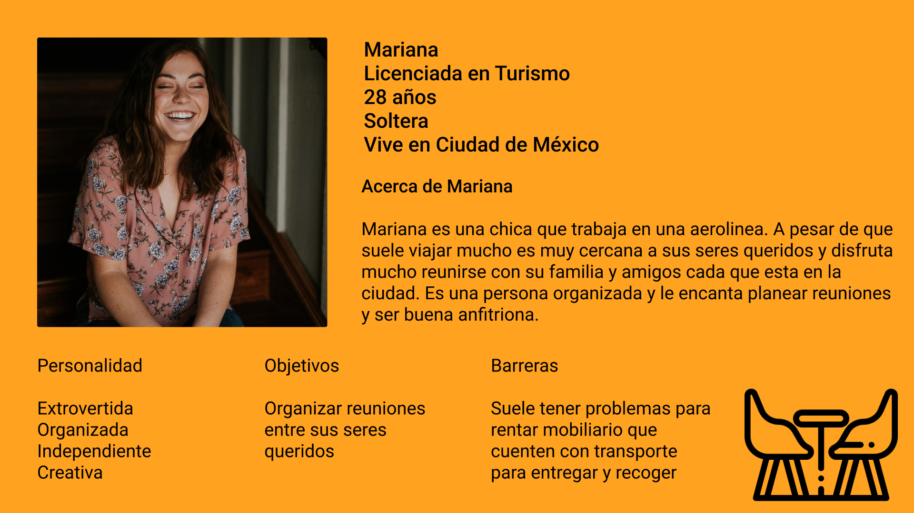

# **RÉNTAMO APP**

# **Réntamo App** permite rentar muebles en tiempo real, agendando eficientemente la renta y mostrando de manera atractiva y simple el catálogo disponible.

## [Wireframes](https://www.figma.com/proto/iwnDFedXpM7z3Jb18n45JC/RR%C3%89NTAMO_APP_MOCKUP?node-id=6%3A32&scaling=scale-down&page-id=6%3A2&starting-point-node-id=6%3A32)

## [Prototipo](https://www.figma.com/proto/iwnDFedXpM7z3Jb18n45JC/RR%C3%89NTAMO_APP_MOCKUP?node-id=10%3A1298&scaling=scale-down&page-id=10%3A253&starting-point-node-id=10%3A1298)

## **Proceso**
Para el desarrollo de este proyecto decidí apoyarme de la técnica de las 5Ws para entender el problema y entender la necesidad del usuario.

### **Las 5W’s**

 **WHO / ¿Quién es mi usuario?**

Un organizador de eventos sociales puede englobar personas profesionales como un wedding planner, una directora académica que anualmente organiza la salida de los alumnos de última generación o una persona de algún núcleo familiar que organiza fiestas dentro de su entorno personal.

Decidí definir a mi usuario como una persona entre 25 y 35 años qué no se dedica profesionalmente a organizar eventos pero que ha tenido la necesidad de buscar mobiliario por lo menos una vez para una reunión familiar.

**WHAT / ¿Qué problema tiene?**

La persona necesita rentar mobiliario (esencialmente mesas y sillas) para un evento
social familiar y cuenta con menos de 3 días para conseguir el mobiliario.

**WHERE / ¿Dónde lo está solucionando?**

Por recomendación de personas de su entorno le han recomendado algunos lugares que rentan este tipo de mobiliario, locales cerca a su zona de residencia, pero pierde mucho tiempo llamando y visitando el lugar.

**WHEN / ¿Cuándo se enfrenta al problema?**

En los locales cercanos a la persona le comentan que la renta de mobiliario se debe
hacer con un tiempo anticipado de 7 días, por cuestión de disponibilidad. Además, no
dispone de transporte para mover el mobiliario ella misma. En otros lugares le comentan que primero hacen la cotización antes de proporcionarle el precio.

**WHY / ¿Por qué es importante para él resolverlo?**

La persona ya tiene una fecha establecida y no puede hacer cambios de último
momento, ya cuenta con servicio de comida, lugar, lista de invitados confirmada, por lo que necesita hacer la contratación de los muebles en el menor tiempo posible.

## **Conociendo a mi usuario**
Para definir concretamente a mi usuario-persona, realicé una encuesta preguntando por medio de whatsapp si por lo menos alguna vez habían organizado una fiesta o reunión familiar y si habían hecho compras en línea. El rango de edad de las personas que respondieron es de 28 a 35 años.

## [**Enlace a la encuesta**](https://docs.google.com/forms/d/e/1FAIpQLSep8R-LUIkdChjKg-F3B5C5NM5KNk2n3bTtrjgd9cjDjYT_1w/viewform?usp=sf_link)

## [**Enlace a los resultados de la encuesta**](https://www.figma.com/proto/iwnDFedXpM7z3Jb18n45JC/RR%C3%89NTAMO_APP_MOCKUP?node-id=18%3A787&scaling=min-zoom&page-id=17%3A785)

## **User persona**

## **Benchmark**

Realicé una investigación de lo que actualmente existe en el mercado y seleccione 3
plataformas (sitios web y aplicaciones móviles) y me enfoqué en los siguientes puntos:
- Pasos para rentar o adquirir un producto o servicio
- buscador
- manera en cómo presentan la información del producto o servicio
- identificar el proceso para pagar el producto o servicio adquirido

### **De acuerdo a los resultados obtenidos, encontré los siguientes patrones:**

- El buscador siempre está posicionada en la parte superior de la pantalla, muestra listado de resultados que coinciden con la búsqueda

- Manejan carrito de compra para realizar el proceso de “renta”, sin embargo, en las plataformas de mobiliario no menciona tiempo de entrega o respuesta

- Al confirmar la “orden” muestran un formulario para llenar datos de la dirección y seleccionar método de pago.

- Todas las plataformas cuentan con categorías, subcategorías, dependiendo de la variedad de producto

- Los detalles de cada artículo son : foto,nombre, precio, cantidad, descripción, botón para agregar a carrito

## [**Enlace de las notas del benchmark**](https://www.figma.com/proto/iwnDFedXpM7z3Jb18n45JC/RR%C3%89NTAMO_APP_MOCKUP?node-id=12%3A684&scaling=min-zoom&page-id=12%3A683&starting-point-node-id=12%3A684)

